## Automated ELK Stack Deployment

The files in this repository were used to configure the network depicted below.

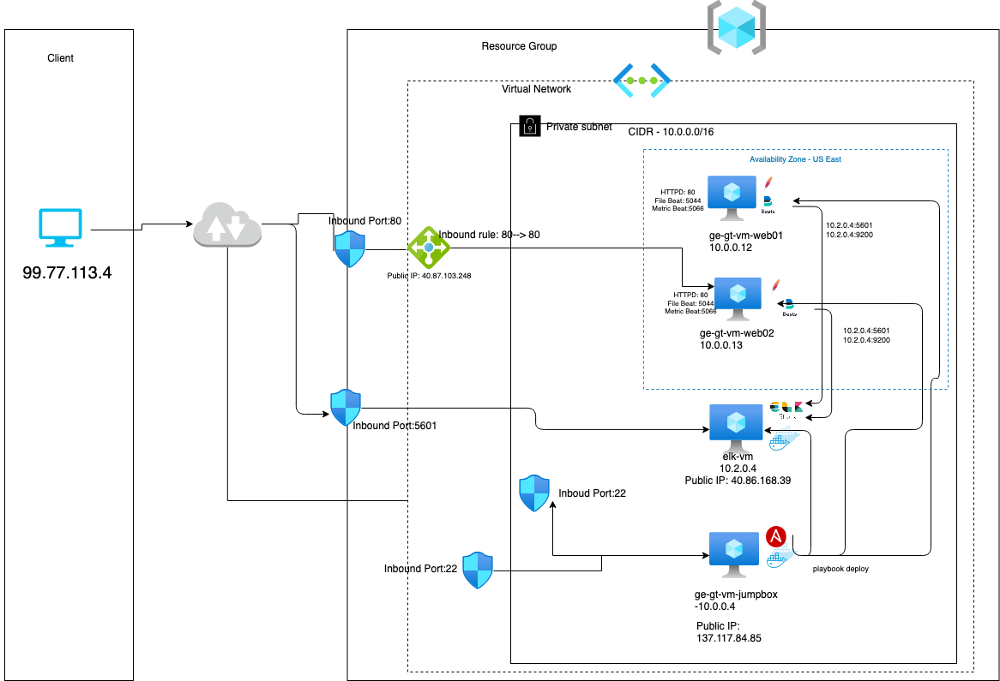

These files have been tested and used to generate a live ELK deployment on Azure. They can be used to either recreate the entire deployment pictured above. Alternatively, select portions of the _____ file may be used to install only certain pieces of it, such as Filebeat.

  - [install-elk.yml](https://github.com/dinshetty/ge-gt-elk-project/tree/main/Ansible/install-elk.yml) - Ansible playbook for installing ELK tech stack
  - [filebeat-playbook.yml](https://github.com/dinshetty/ge-gt-elk-project/tree/main/Ansible/filebeat-playbook.yml) - Ansible playbook for installing filebeat agent on webservers
  - [metricbeat-playbook.yml](https://github.com/dinshetty/ge-gt-elk-project/tree/main/Ansible/metricbeat-playbook.yml) - Ansible playbook for installing metricbeat agent on webservers
 
This document contains the following details:
- [Description of the Topology](#desc)
- Access Policies
- ELK Configuration
  - Beats in Use
  - Machines Being Monitored
- How to Use the Ansible Build

### Description of the Topology

The main purpose of this network is to expose a load-balanced and monitored instance of DVWA, the D*mn Vulnerable Web Application.

Load balancing ensures that the application will be highly available, in addition to restricting access to the network.
- Load balancer protects the servers catering the content and webservers can be accessed via load balancer only. Jumpbox is the single point of entry for all servers access within the VPN and this protects the servers by not directly exposing outside. 

Integrating an ELK server allows users to easily monitor the vulnerable VMs for changes to the webserver logs and system logs.
- Filebeat agents collects the logs from webservers (httpd -apache) and send it logstash/elasiticsearch
- Metricbeat agents collects the logs from system related cpu, memory etc and send it logstash/elasiticsearch

The configuration details of each machine may be found below.

| Name              | Function   | IP Address | Operating System |Public IP      |
|-------------------|------------|------------|------------------|--------------- 
| ge-gt-vm-jumboxer | Gateway    | 10.0.0.4   | Linux            | 20.85.227.175 |
| elk-vm            | ELK stack  | 10.2.0.4   | Linux            | 40.86.168.39  |
| ge-gt-vm-web01    | Webserver  | 10.0.0.12  | Linux            |  NA           |
| ge-gt-vm-web02    | Webserver  | 10.0.0.13  | Linux            |  NA           | 

### Access Policies

The machines on the internal network are not exposed to the public Internet. 

Only the Jumpbox machine can accept connections from the Internet. Access to this machine is only allowed from the following IP addresses:
- Client IP - 99.77.119.8 is whitlisted to allow connection to jump box via port 22. This rule is configured in Network Security Group (NSG)

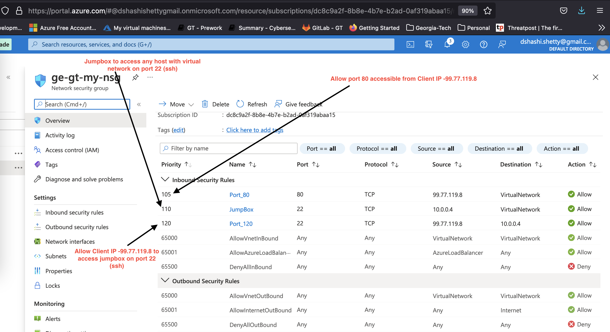

Machines within the network can only be accessed by Jump box as well ELK servers.
-  ELK machine can be accessed via port 22 (ssh) only from jumpbox and accessed on port 5601 from Client IP 99.77.119.8

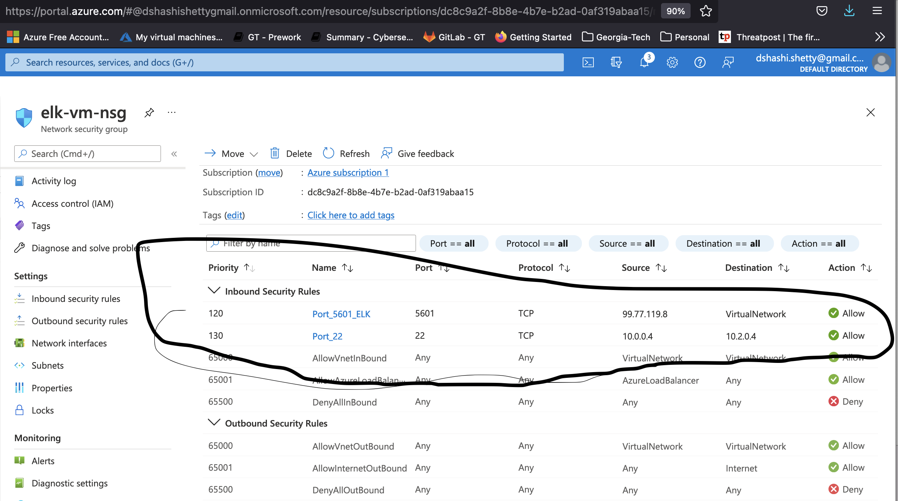

A summary of the access policies in place can be found in the table below.

| Name     | Publicly Accessible | Allowed IP Addresses |
|----------|---------------------|----------------------|
| Jump Box | Yes                 | 10.0.0.1 10.0.0.2    |
|          |                     |                      |
|          |                     |                      |

Network Access Group - Inbound rules to allow jumpbox host access from specific client IP on port 22 (ssh) and allow jumpbox to access any IP in within the vitual network.

Network Access Group - Inbound rules for ELK to allow specific client IP to access ELK host with port 5601

### Elk Configuration

Ansible was used to automate configuration of the ELK machine. No configuration was performed manually, which is advantageous because the same configuration machine can be built again & again without any human intervention. Refer to anisble playbook - [install-elk.yml](https://github.com/dinshetty/ge-gt-elk-project/tree/main/Ansible/install-elk.yml) for aditional details. Below explains each section in playbook

The playbook implements the following tasks:
- Download & install Docker

  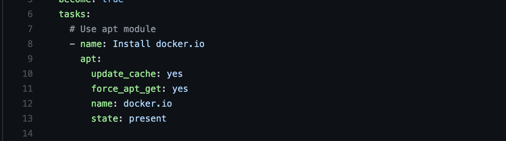

- Download & install python3-pip module
  
  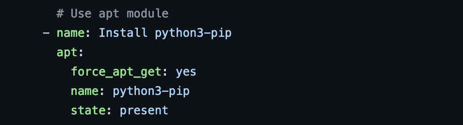

- Download & install python docker module

  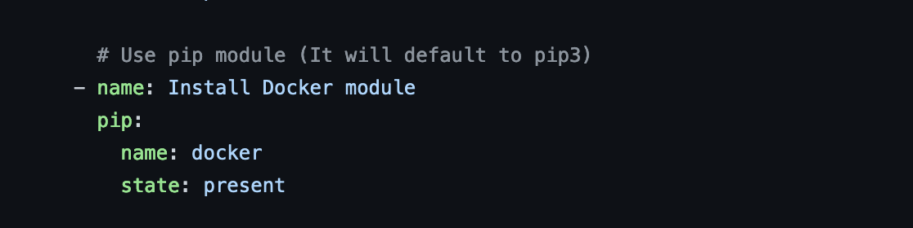
   
- Update max_map_count for ELK with additional memory
  
  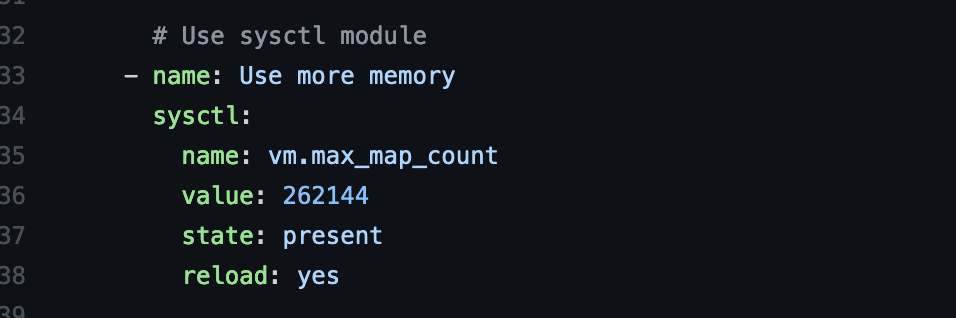

- Download & install ELK stack using docker image sebp/elk:761

  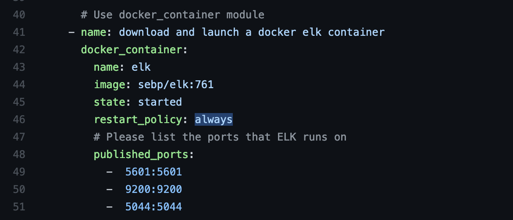
  
- Enable docker service to kickoff on machine restart/on boot

  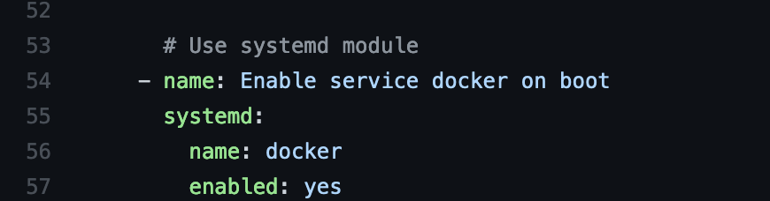

The following screenshot displays the result of running `docker ps` after successfully configuring the ELK instance.

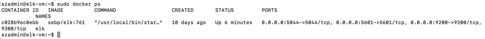

### Target Machines & Beats
This ELK server is configured to monitor the following machines where apache http webserver running on:

| Name            | Function   | IP Addresses | Operating Systems   | Softwares           |  Port  |
|-----------------|---------------------------|---------------------|---------------------|--------|-------
| ge-gt-vm-web01  | Webserver  | 10.0.0.12    | Linux               |  Apache HTTP Server | 80     |
| ge-gt-vm-web02  | Webserver  | 10.0.0.13    | Linux               |  Apache HTTP Server | 80     | 

We have installed the following Beats on these machines:
- FileBeat (dpkg -i filebeat-7.4.0-amd64.deb) -- refer the ansible playbook [filebeat-playbook.yml](https://github.com/dinshetty/ge-gt-elk-project/tree/main/Ansible/filebeat-playbook.yml) 
- MetricBeat (metricbeat-7.4.0-amd64.deb) - refer the ansible playbook [metricbeat-playbook.yml](https://github.com/dinshetty/ge-gt-elk-project/tree/main/Ansible/metricbeat-playbook.yml) 

These Beats allow us to collect the following information from each machine:
- FileBeat collects the logs information from apache webservers pushed to logstash, which is indexed by elasticsearch and displayed on Kibana as below

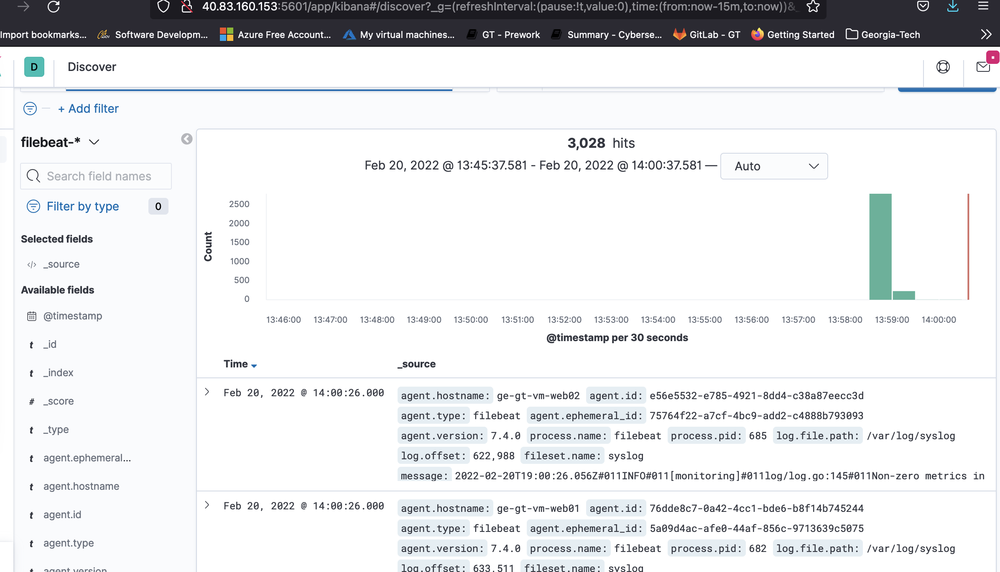

- MetricBeat collects all the system informations like cpu, memory etc for the analysis to logstash, which is indexed by elasticsearch and displayed on Kibana as below

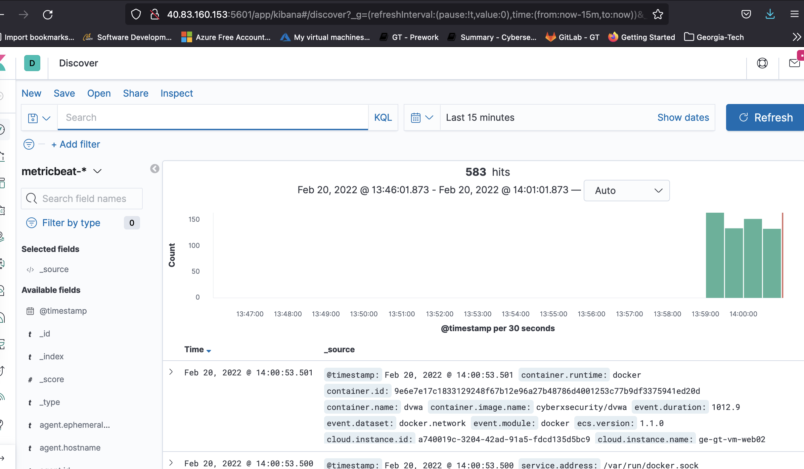

### Using the Playbook
In order to use the playbook, you will need to have an Ansible control node already configured. Assuming you have such a control node provisioned: 

SSH into the control node and follow the steps below:
- Copy the playbook file to /etc/ansible/. Below screenshot shows all the playbooks related to elk (install-elk.yml), filebeat (filebeat-playbook.yml) and metricbeat ( metricbeat-playbook.yml)

- Update the hosts file to include IPs of webservers and elk server

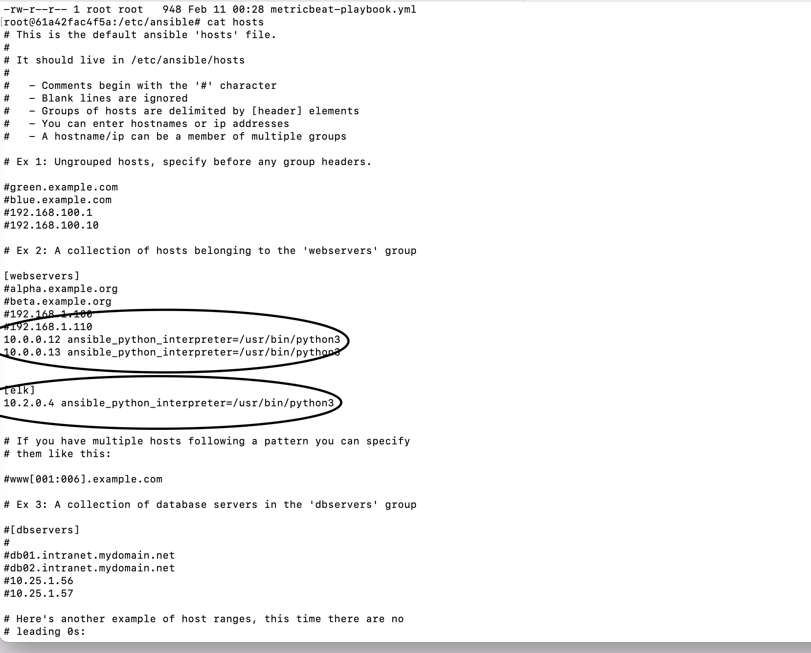

- Run the playbook, and navigate to target hosts to check that the installation worked as expected. Hosts file list down the grouping of servers. For example webservers, elk. Playbook yaml file will have hosts tag with targted host group name. Example elk as in screenshot

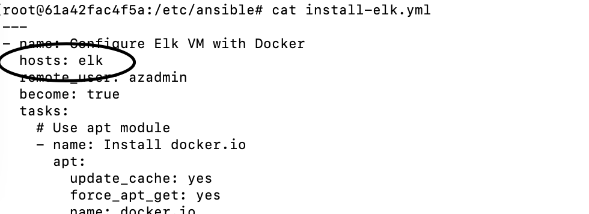

In case if ELK, confirm the docker process is running in ELK virtual machine 

Also confirm Kibana URL up by navigating to the URL - http://40.83.160.153:5601/app/kibana in any browser. If you get the below screen, playbook successfully executed

