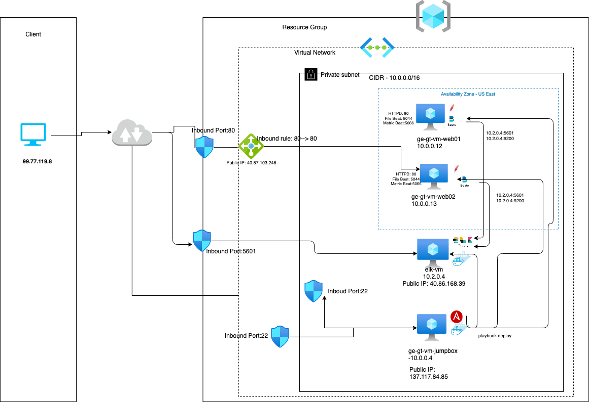

## Automated ELK Stack Deployment

The files in this repository were used to configure the network depicted below.

These files have been tested and used to generate a live ELK deployment on Azure. They can be used to either recreate the entire deployment pictured above. Alternatively, select portions of the _____ file may be used to install only certain pieces of it, such as Filebeat.

  - [install-elk.yml](https://github.com/dinshetty/ge-gt-elk-project/tree/main/Ansible/install-elk.yml) - Ansible playbook for installing ELK tech stack
  - [filebeat-playbook.yml](https://github.com/dinshetty/ge-gt-elk-project/tree/main/Ansible/filebeat-playbook.yml) - Ansible playbook for installing filebeat agent on webservers
  - [metricbeat-playbook.yml](https://github.com/dinshetty/ge-gt-elk-project/tree/main/Ansible/metricbeat-playbook.yml) - Ansible playbook for installing metricbeat agent on webservers
 
This document contains the following details:
- Description of the Topology
- Access Policies
- ELK Configuration
  - Beats in Use
  - Machines Being Monitored
- How to Use the Ansible Build

### Description of the Topology

The main purpose of this network is to expose a load-balanced and monitored instance of DVWA, the D*mn Vulnerable Web Application.

Load balancing ensures that the application will be highly available, in addition to restricting access to the network.
- Load balancer protects the servers catering the content and webservers can be accessed via load balancer only. Jumpbox is the single point of entry for all servers access within the VPN and this protects the servers by not directly exposing outside. 

Integrating an ELK server allows users to easily monitor the vulnerable VMs for changes to the webserver logs and system logs.
- Filebeat agents collects the logs from webservers (httpd -apache) and send it logstash
- Metricbeat agents collects the logs from system related cpu, memory etc and send it logstash

The configuration details of each machine may be found below.

| Name              | Function   | IP Address | Operating System |Public IP      |
|-------------------|------------|------------|------------------|--------------- 
| ge-gt-vm-jumboxer | Gateway    | 10.0.0.1   | Linux            | 20.85.227.175 |
| elk-vm            | ELK stack  | 10.2.0.4   | Linux            | 40.86.168.39  |
| ge-gt-vm-web01    | Webserver  | 10.0.0.12  | Linux            |  NA           |
| ge-gt-vm-web02    | Webserver  | 10.0.0.13  | Linux            |  NA           | 

### Access Policies

The machines on the internal network are not exposed to the public Internet. 

Only the Jumpbox machine can accept connections from the Internet. Access to this machine is only allowed from the following IP addresses:
- Client IP - 99.77.113.4 is whitlisted to allow connection to jump box via port 22. This rule is configured in Network Security Group (NSG)

Machines within the network can only be accessed by Jump box as well ELK servers.
- _TODO: Which machine did you allow to access your ELK VM? What was its IP address?_

A summary of the access policies in place can be found in the table below.

| Name     | Publicly Accessible | Allowed IP Addresses |
|----------|---------------------|----------------------|
| Jump Box | Yes                 | 10.0.0.1 10.0.0.2    |
|          |                     |                      |
|          |                     |                      |

### Elk Configuration

Ansible was used to automate configuration of the ELK machine. No configuration was performed manually, which is advantageous because the same configuration machine can be built again & again without any human intervention. Refer to anisble playbook - [install-elk.yml](https://github.com/dinshetty/ge-gt-elk-project/tree/main/Ansible/install-elk.yml) for aditional details. Below explains each section in playbook

The playbook implements the following tasks:
- Download & install Docker

  

- Download & install python3-pip module
  
  

- Download & install python docker module

  
   
- Update max_map_count for ELK with additional memory
  
  

- Download & install ELK stack using docker image sebp/elk:761

  
  
- Enable docker service to kickoff on machine restart/on boot

  

The following screenshot displays the result of running `docker ps` after successfully configuring the ELK instance.

### Target Machines & Beats
This ELK server is configured to monitor the following machines:

| Name            | Function   | IP Addresses | Operating Systems   | Softwares           |  Port  |
|-----------------|---------------------------|---------------------|---------------------|--------|-------
| ge-gt-vm-web01  | Webserver  | 10.0.0.12    | Linux               |  Apache HTTP Server | 80     |
| ge-gt-vm-web02  | Webserver  | 10.0.0.13    | Linux               |  Apache HTTP Server | 80     | 

We have installed the following Beats on these machines:
- FileBeat (dpkg -i filebeat-7.4.0-amd64.deb) -- refer the ansible playbook [filebeat-playbook.yml](https://github.com/dinshetty/ge-gt-elk-project/tree/main/Ansible/filebeat-playbook.yml) 
- MetricBeat (metricbeat-7.4.0-amd64.deb) - refer the ansible playbook [metricbeat-playbook.yml](https://github.com/dinshetty/ge-gt-elk-project/tree/main/Ansible/metricbeat-playbook.yml) 

These Beats allow us to collect the following information from each machine:
- _TODO: In 1-2 sentences, explain what kind of data each beat collects, and provide 1 example of what you expect to see. E.g., `Winlogbeat` collects Windows logs, which we use to track user logon events, etc._

### Using the Playbook
In order to use the playbook, you will need to have an Ansible control node already configured. Assuming you have such a control node provisioned: 

SSH into the control node and follow the steps below:
- Copy the _____ file to _____.
- Update the _____ file to include...
- Run the playbook, and navigate to ____ to check that the installation worked as expected.

_TODO: Answer the following questions to fill in the blanks:_
- _Which file is the playbook? Where do you copy it?_
- _Which file do you update to make Ansible run the playbook on a specific machine? How do I specify which machine to install the ELK server on versus which to install Filebeat on?_
- _Which URL do you navigate to in order to check that the ELK server is running?

_As a **Bonus**, provide the specific commands the user will need to run to download the playbook, update the files, etc._
